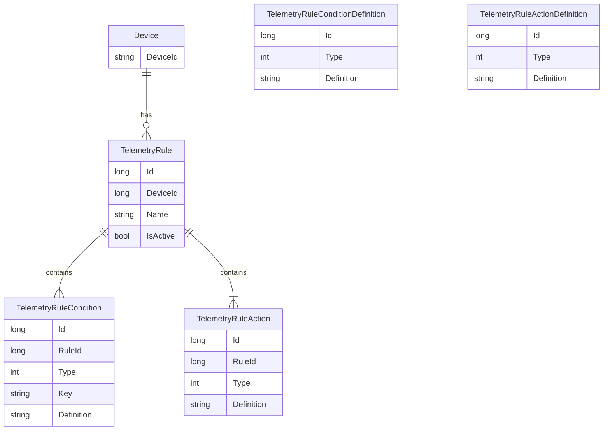

# Rule System

Agrigate's rule system allows you to dynamically create and modify rules that
are applied to certain entities when events occur. Creating rules allows
automation such as receiving a notification or updating how a device operates
without having to code all of that logic on the device itself.

## Overview

Rules are defined in individual tables that apply to a particular entity.
`TelemetryRule`, for example, contains rules that apply to incoming telemetry
from a device.

Each rule can have multiple conditions and multiple actions. Conditions define
the criteria for when an action (or actions) should take place, while actions
define what actually occurs.

Once all conditions have been met for a rule, all actions associated with that
rule will be performed.

## Data Model

To define the rule system, the following entities are used:

- **TelemetryRule** - Defines a single rule for incoming telemetry from a device
- **TelemetryRuleCondition** - Defines a condition for the telemetry that must
  be met
- **TelemetryRuleAction** - Defines an action taken when all
  `TelemetryRuleConditions` have been met
- **TelemetryRuleConditionDefinition** - The Agrigate definition for a given
  condition. It's used by the UI to dynamically render any required fields for
  a particular condition, in addition to creating the `Definition` property for
  the `TelemetryRuleCondition`
- **TelemetryRuleActionDefinition** - The Agrigate definition for a given
  action. It's used by the UI to dynamically render any required fields for a
  particular action, in addition to creating the `Definition` property for the
  `TelemetryRuleAction`

  The `Definition` fields for `TelemetryRuleCondition`, `TelemetryRuleAction`,
  `TelemetryRuleConditionDefinition`, and `TelemetryRuleActionDefinition` are
  JSON strings.

  The `Type` field for `TelemetryRuleCondition` and
  `TelemetryRuleConditionDefinition` are enums relating to rule conditions,
  while the `Type` field for `TelemetryRuleAction` and
  `TelemetryRuleActionDefinition` are enums relating to rule actions.

  | RuleCondition |
  | ------------- |
  | UpperLimit    |
  | LowerLimt     |
  | Range         |

  | RuleAction   |
  | ------------ |
  | Notification |



## Rule Definition Examples

The following are examples of what the `Definition` field looks like for rule
conditions and rule actions.

### TelemetryRuleConditionDefinition

When displayed in the UI, `type` is used to determine what type of field is
displayed and `label` will be used for the field's label. When saving,
json will be created using the value of `key` as a dictionary key while
formating the user-supplied input as the appropriate type

```
# Upper & Lower Limit
[
    {
        'label': 'Upper Limit',
        'key': 'value',
        'type': 'int'
    }
]

# Range
[
    {
        'label': 'Upper Limit',
        'key': 'upperLimit',
        'type': 'int'
    },
    {
        'label': 'Lower Limit',
        'key': 'lowerLimit',
        'type': 'int'
    }
]

```

### TelemetryRuleCondition

The end result of a definition after creating a rule condition would be as
follows

```
# Upper & Lower Limit
{
    'value': 10
}

# Range
{
    'upperLimit': 10,
    'lowerLimit': 4
}
```

### TelemetryRuleActionDefinition

Action definitions are used in a similar way as condition defitions. In this
example, the second item has a `dependsOn` field and the label is an object,
which means the label will change based on the user-selected value of `channel`.

```
# Notification
[
    {
        'label': 'Type'
        'key': 'channel'
        'type': 'select',
        'options': [
            {
                'id': 0
                'label': 'MQTT'
            },
            {
                'id': 1
                'label': 'Email'
            },
            {
                'id': 2
                'label': 'SMS'
            }
        ]
    },
    {
        'dependsOn: 'channel',
        'label': {
            0: 'Channel',
            1: 'Email Address',
            2: 'Phone Number'
        },
        'key': 'address',
        'type': 'string'
    }
]
```

### TelemetryRuleAction

The end result of a definition after creating a rule action would be as
follows

```
# MQTT Notification

{
    'channel': 0,
    'address': 'notifications'
}

# Email Notification
{
    'channel': 1,
    'address': 'john@doe.com'
}

# SMS Notication
{
    'channel': 2,
    'address': '555-555-5555'
}
```

## Rule Engine

The rule engine is the system that validates and executes all rules that have
been created.

## Telemetry Rule Workflow
