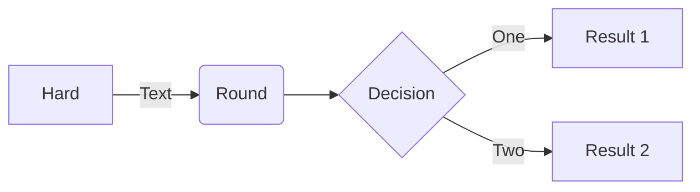

# Introduction

Welcome to the Agrigate documentation. This site contains all documentation related to Agrigate, including
details about how it works, how to use it, and how to operate your own instance of the software.

Agrigate is an open source project that contains multiple components, all focused on building and connecting a 
decentralized food system. It can be installed by an individual farm, an operator of a farm stop, or even a consumer
who wants to help build a stronger, more resilient food hub. 

## Background

TODO: Why the software is being created and how it came about

## Components

TODO: The different components that exist within Agrigate 

## Quick Start Notes:

1. Add images to the *images* folder if the file is referencing an image.

> [!NOTE]
> Information the user should notice even if skimming.

> [!TIP]
> Optional information to help a user be more successful.

> [!IMPORTANT]
> Essential information required for user success.

> [!CAUTION]
> Negative potential consequences of an action.

> [!WARNING]
> Dangerous certain consequences of an action.